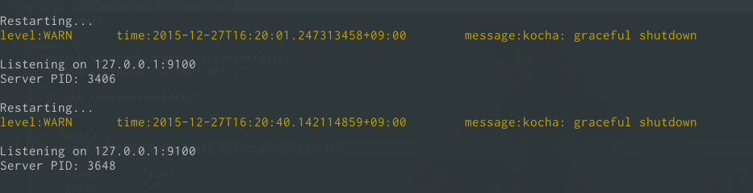

class: center, middle

Kocha をやってみた
===============


<br>


2015/12/27 <a href="https://giveryengineersupport.doorkeeper.jp/events/36514">もくもく会 at 株式会社オロ</a>

---


だれ?
--------

.col-xs-6[
### Pocke


- GitHub: [`@pocke`](https://github.com/pocke)
- Twitter [`@p_ck_`](https://twitter.com/p_ck_)
]

.col-xs-6[

.pocke-img[

]

]

---

なにしてるの?
------

- Ruby (on Rails)
- Go
- TypeScript

---

今日のまとめ
--------

--

# 進捗ダメでした!

---

今日のまとめ
--------

--

- お疲れ様でした

--

- 動機: 色んな人と知り合いたい

--

  - 来てみたら同じ机全部知ってる人!

--

- あとで話しかけて下さい!

---


今日は何やってたの?
---------


- Golang で Web アプリ作ってました

--

.center[
# (未完)
]

--

.center[
# 全然進んでない!
]
---


なにはなすの?
---------

- [kocha](https://github.com/naoina/kocha) という Golang の WAF

--

  - Web Application Framework

---

なんで kocha ?
---------

- Go で Web アプリ作りたい!

--

- フレームワークなしの世界に疲れてきた…

--

- kocha よいかも? 使ってみよう!

---

いい感じなとこ
--------

### Rails っぽい

--



- ファイルの変更を見て勝手にリスタートしてくれる!

---

いい感じなとこ
-----------

### Rails っぽい

--

- コードジェネレータ

```sh
# user model を作成
$ kocha g model user

# user controller を作成
$ kocha g controller user

# マイグレーション を作成
$ kocha g migrate user
```

--

.center[
## べんりそう!!!
]

---

つらい感じなとこ
---------

- ビルドが遅い

--

- 折角自動リロードがあるのにその度にめっちゃCPU食う

--

- 強制的に `-race` オプションがついてた

---

つらい感じなとこ
---------

- コメントアウトしたらめっちゃはやくなった

```diff
diff --git a/cmd/kocha-run/main.go b/cmd/kocha-run/main.go
index 7bba518..bed939e 100644
--- a/cmd/kocha-run/main.go
+++ b/cmd/kocha-run/main.go
@@ -101,7 +101,7 @@ func runApp(basedir, execName, importPath string) (*exec.Cmd, error) {
 	execPath := filepath.Join(basedir, execName)
 	execArgs := []string{"build", "-o", execPath}
 	if runtime.GOARCH == "amd64" {
-		execArgs = append(execArgs, "-race")
+		// execArgs = append(execArgs, "-race")
 	}
 	execArgs = append(execArgs, importPath)
 	c, err := execCmd("go", execArgs...)
```

---


つらい感じなとこ
------------

- Routing がむずかしい

--

- なんか CRUD に特化してる

--

- パスとコントローラーが 1対1 になってる

---

つらい感じなとこ
------------

- こんな感じ


```go
{
  Name:       "user",
  Path:       "/api/user/:id",
  Controller: &controller.User{},
}, {
  Name:       "user",
  Path:       "/api/user",
  Controller: &controller.User{},
},
```


---


つらい感じなとこ
---------

- DRY に書けない

--

- Go にジェネリクスがほしい……

--

- kocha が原因ではない!

---

おしえて
--------

- Golang で Web、詳しい人いたらおしえてください

---

けつろん
---------

- Rails はすごい
